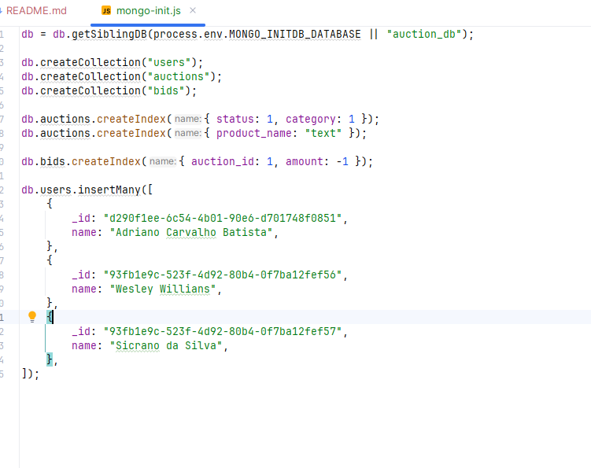
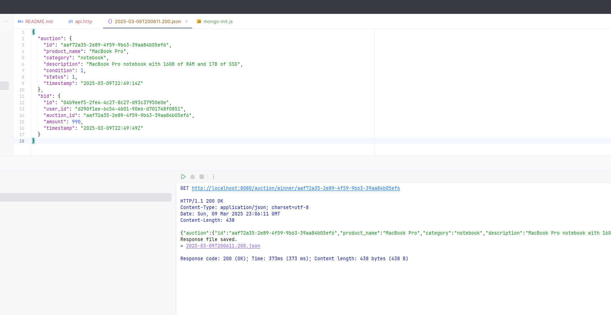

# Documentação do Projeto labs-auction-goexpert

## 1. Visão Geral
O **labs-auction-goexpert** é um projeto desenvolvido em **Go** para gerenciar leilões online. Ele fornece uma API REST para criar, atualizar, consultar e remover itens de leilão, utilizando **MongoDB** como banco de dados e **Docker** para facilitar a execução.

## 2. Tecnologias Utilizadas
- **Go** (Golang) 
- **MongoDB**
- **Docker** / **Docker Compose**
- **Gi** (Gin Web Framework)
- **Módulo de Tratamento de Erros Personalizado**

## 3. Como Executar o Projeto
### Via Docker
1. Certifique-se de ter o **Docker** e **Docker Compose** instalados.
2. No diretório raiz do projeto, execute:
   ```sh
   docker-compose up -d
   ```
3. O servidor estará rodando na porta **8080**.

### Manualmente (Localmente)
1. Instale as dependências do projeto:
   ```sh
   go mod tidy
   ```
2. Execute o servidor:
   ```sh
   go run main.go
   ```

## 4. Rotas da API
A API possui as seguintes rotas:

Arquivo **api.http** para executar a aplicação


### **Leilões (Auctions)**
- **Criar leilão**
  - **POST** `http://localhost:8080/auction`
  - **Descrição:** Cria um novo leilão.
  - **Payload:**
    ```json
    {
      "product_name": "Nome do produto do leilão",
      "category": "Categoria",
      "description": "Descrição",
      "condition": 1
    }
    ```
  - **Resposta:** `201 Created`

- **Consultar leilões**
  - **GET** `http://localhost:8080/auction?status=0`
  - **Descrição:** Retorna todos os leilões com o status informado.

- **Consultar bid vencedor**
  - **GET** `http://localhost:8080/auction/winner/{auction_id}`
  - **Descrição:** Retorna o lance vencedor para um determinado leilão.

### **Lances (Bids)**
- **Criar bid**
  - **POST** `http://localhost:8080/bid`
  - **Descrição:** Cria um novo lance em um leilão.
  - **Payload:**
    ```json
    {
      "user_id": "user_id",
      "auction_id": "11c202ad-baec-4150-864b-d0d6a97ededa",
      "amount": 990.0
    }
    ```
  - **Resposta:** `201 Created`

- **Consultar bids de um leilão**
  - **GET** `http://localhost:8080/bid/{auction_id}`
  - **Descrição:** Retorna todos os lances de um determinado leilão.

## 5. 📊 Evidências de Execução





Se precisar de ajustes, me avise! 🚀

